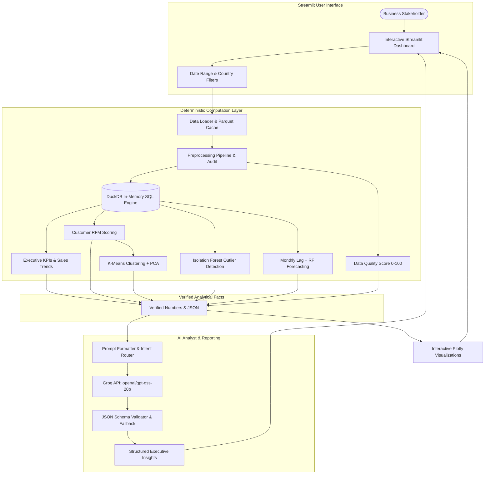

# InsightAI — GenAI-Powered Retail Analytics & Business Intelligence

[](https://www.python.org/downloads/)
[](https://streamlit.io/)
[](https://duckdb.org/)
[](https://scikit-learn.org/)
[](https://groq.com/)
[](LICENSE)

> **InsightAI** is an enterprise-grade retail analytics platform that bridges the gap between deterministic data science and Generative AI. Built on the real **UCI Online Retail II** dataset (~1 million transactions across two years), it enables business executives and commercial analysts to ask ad-hoc questions in plain English and receive evidence-grounded insights strictly verified by Python, DuckDB, and Scikit-Learn.

---

## 🎯 Why This Project Exists

In enterprise analytics, **hallucination is unacceptable**. Traditional attempts to connect raw LLMs directly to databases frequently suffer from calculation errors, invented numbers, and confusing correlation with causation.

InsightAI implements a strict **separation of concerns**:
1. **Deterministic Layer (Python, DuckDB, Scikit-Learn)**: Executes 100% of mathematical calculations, aggregations, customer segmentations, anomaly detections, and time-series forecasts.
2. **Generative Layer (Groq LLM)**: Ingests only verified numerical results and synthesizes executive narratives, clearly distinguishing observed **Facts**, **Patterns**, **Hypotheses**, and **Recommendations**.

---

## 🏗️ System Architecture



---

## 🚀 Key Features

### 1. 📊 Executive Overview Dashboard
- **Real-Time KPI Cards**: Total Gross Revenue, Invoices, Transacting Accounts, Catalog SKUs, Average Order Value (AOV), and Total Units Sold.
- **Interactive Plotly Visuals**: Revenue trajectory over time, country revenue distribution, top 10 products, and highest-value accounts.
- **Dynamic Cross-Filtering**: Filter by date range and country across the entire workspace.

### 2. 📈 Sales Analytics
- **Month-over-Month (MoM) Growth**: Tracks monthly sales velocity, growth percentages, and order volume.
- **Product Performance Ledger**: Sortable, searchable SKU-level metrics including quantity, order frequency, unit price, and total revenue share.
- **Temporal Velocity**: Breakdown of purchasing volume across days of the week and hours of the day.

### 3. 👥 Customer Analytics & RFM Segmentation
- **Empirical RFM Modeling**: Recency (days since last purchase), Frequency (order count), and Monetary Value (total spend).
- **Quantile Scoring (1–5)**: Categorizes accounts into actionable segments (*Champions, Loyal Customers, Potential Loyalists, At Risk, Lost Customers*).
- **Interactive 2D Landscape**: Recency vs Spend scatter plot with logarithmic scaling.

### 4. 🤖 Machine Learning Customer Segmentation
- **Unsupervised K-Means**: Preprocesses skewed retail spend via $\log(1+x)$ transformation and standard scaling.
- **Configurable K**: Interactive slider (2 to 8 clusters).
- **PCA 2D Cluster Projection**: Visualizes high-dimensional behavioral groupings.
- **Automated Personas**: Generates descriptive personas (*High-Value VIPs, Churn Risks, Recent Buyers*) with tailored retention strategies.

### 5. 🔍 Anomaly Detection (Isolation Forest)
- **Multi-Dimensional Outlier Scoring**: Evaluates `Quantity`, `UnitPrice`, and `Revenue`.
- **Configurable Contamination**: Slider for sensitivity tuning (default 1.0%).
- **Responsible Explanations**: Labels records as *"statistically unusual transactions"* (e.g. bulk B2B purchases or catalogue adjustments) rather than asserting unproven fraud.

### 6. 🔮 Sales Forecasting
- **Autoregressive Feature Engineering**: Multi-step lag features (`Lag_1`, `Lag_2`, rolling 2-month window).
- **Dual Algorithms**: Random Forest Regressor and Linear Regression for a 3-month forecast horizon.
- **Directional Trend Indicator**: Real-time trajectory badge (*Increasing, Stable, Decreasing*) with clear predictive notices.

### 7. 💡 AI Business Analyst
- **Intent Router**: Automatically detects user query intent (`summary`, `ranking`, `trend`, `customer_analysis`, `product_analysis`, `country_analysis`, `rfm`, `anomaly`, `forecast`, `data_quality`).
- **Ground Truth Enforcement**: Feeds verified Python/DuckDB metrics into Groq; parses structured JSON output.
- **Categorized Findings**: Separates bullet points into `[FACT]`, `[PATTERN]`, `[HYPOTHESIS]`, and `[RECOMMENDATION]`.

### 8. 🛡️ Data Quality & Preprocessing Audit
- **Data Quality Score (0–100)**: Evaluates missing Customer IDs, duplicate records, zero/negative unit prices, negative return quantities, and missing descriptions.
- **Complete Transparency**: Audit log showing exactly how many records were isolated and why—no silent data deletion.

### 9. 📑 Executive Board Report Generator
- **One-Click Synthesis**: Aggregates all commercial pillars into an executive memorandum.
- **Export Options**: View in-app and download directly as a formatted `.md` Markdown report.

### 10. ⚙️ Ingestion & Settings
- **1-Click UCI Ingestion**: Downloads official Excel dataset and converts to Parquet.
- **Custom Dataset Upload**: Upload custom CSV, Excel, or Parquet datasets with automatic schema normalization.
- **Configurable LLM**: Switch between Groq, Ollama, and full Demo Mode.

---

## 📦 Dataset

**UCI Machine Learning Repository: Online Retail II**  
- **Link**: [https://archive.ics.uci.edu/dataset/502/online+retail+ii](https://archive.ics.uci.edu/dataset/502/online+retail+ii)  
- **Nature**: Real retail transaction records covering all transactions occurring between 01/12/2009 and 09/12/2011 for a UK-based non-store online retail business.
- **Scope**: ~1,067,371 rows across two fiscal sheets (`Year 2009-2010` and `Year 2010-2011`).
- *Note*: This is an actual retail transaction dataset used to demonstrate enterprise business intelligence and AI capabilities.

---

## 🛠️ Tech Stack

| Component | Technology | Purpose |
| :--- | :--- | :--- |
| **Frontend** | Streamlit | Enterprise web interface, KPI cards, reactive filters |
| **Database** | DuckDB | High-performance in-memory analytical SQL queries |
| **Data Processing** | Pandas, NumPy, PyArrow | Data transformations, Parquet storage, schema normalization |
| **Visualization** | Plotly Express & Graph Objects | Dynamic, interactive charts with custom dark theme |
| **Machine Learning** | Scikit-Learn | K-Means, PCA, Isolation Forest, Random Forest |
| **Generative AI** | Groq API / Ollama | Natural-language executive insights and structured JSON |
| **Testing** | Pytest | Automated test coverage for analytics and ML models |

---

## 💻 Installation & Setup

### 1. Clone & Navigate
```bash
git clone https://github.com/yourusername/insightai.git
cd insightai
```

### 2. Create Virtual Environment
```bash
python -m venv venv
# On Windows:
venv\Scripts\activate
# On Linux/macOS:
source venv/bin/activate
```

### 3. Install Dependencies
```bash
pip install -r requirements.txt
```

### 4. Configure Environment Variables
Create a `.env` file in the project root (or copy `.env.example`):
```env
GROQ_API_KEY=your_groq_api_key_here
GROQ_MODEL=openai/gpt-oss-20b
LLM_PROVIDER=groq
```
*(Note: If no API key is provided, the application automatically launches in **Demo Mode**, keeping all analytics and visualizations fully functional).*

---

## 🏃‍♂️ Running Locally

Launch the Streamlit dashboard:
```bash
streamlit run app.py
```
Open your browser at `http://localhost:8501`. On first run, InsightAI will automatically download the UCI Online Retail II dataset, parse both workbook sheets, and generate a local Parquet cache (`data/online_retail_II.parquet`) for sub-second subsequent startups.

---

## 🧪 Running Automated Tests

Run the full pytest suite:
```bash
pytest -v tests/
```
Tests cover:
- Revenue calculation and date parsing
- Preprocessing and edge case filtering (cancellations, negative prices, duplicate rows)
- Executive KPIs and Month-over-Month growth logic
- RFM scoring and segment categorization
- K-Means clustering and PCA coordinate reduction
- Isolation Forest anomaly detection
- Autoregressive monthly sales forecasting
- Data Quality Score (0–100) computation

---

## 💬 Example Questions for the AI Analyst

- *"What were our best-selling products?"*
- *"Which country generated the most revenue and what is its share?"*
- *"What happened to revenue over time?"*
- *"Who are our highest-value customers?"*
- *"Analyze our customer segments and identify accounts at risk."*
- *"Find statistically unusual transactions."*
- *"Forecast revenue for the next 3 months."*
- *"Evaluate the overall data quality of our records."*

---

## ⚠️ Limitations & Governance

- **Guest Checkouts**: Retail transactions without a Customer ID (~22%) are retained for aggregate sales and geographic analysis, but isolated when computing customer-level RFM scores.
- **Statistical Outliers**: Isolation Forest flags anomalous combinations of unit price and quantity. These should be viewed as operational audit candidates rather than evidence of fraud.
- **Forecast Horizon**: The 3-month forecast is a statistical projection based on autoregressive lag features; external macro shocks, holiday spikes, and stock-outs require qualitative management adjustment.

---

## 📄 License

Distributed under the MIT License. See `LICENSE` for details.
